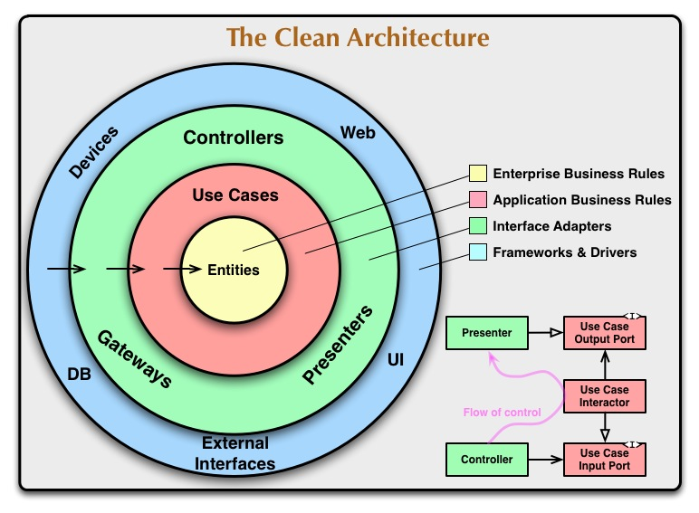

# Good code

## Introduction

There is not a single answer for the question _What is good code?_. There are many different opinions on what good code is. I will try to explain what I think good code is and how to achieve it in the context of web applications development.

Even if we narrow the scope, there are still many different opinions. **Programming is not a science nor a religion**. It is maybe a craft about meaning and communication, but **we can not really measure** the quality of the code precisely. The same goes for books: we can not really tell if the book is crap or excellent, it is very much a matter of taste, education and opinion rather than a fact. Not easy to find a good metric. It is much more subtle than that because **context matters a lot**.

The industry has not been really trying to answer this question properly. Short term speed is seen as a productivity factor, it is not. Not a long time ago I was asked to not make unit tests as they were slowing down the development. Which is nuts, obviously. Velocity is usually told to be the main component for a _good_ team to seek, ignoring the fact that bad code usually lead the team to perform very poorly. The industry has come out with a bunch of tools to manage communication and time, but very little to ensure the quality of the code. So we have to deal with imperfection all the time, there is no way out.

However we can stablish some criteria, and there it is where the opinions can and will diverge.

## Testable, readable, changeable

I would argue that good code must be easily testable, readable and changeable:

- A test is the only proof that the code works. Code without tests is untrustworthy.
- A unit test only asserts business rules.
- A good unit test is possible if the code is very well decoupled. So it is key to have an architecture that allows to isolate the business code. Like hexagonal architecture (Ports and adapters). 
- Our business code must be framework-agnostic.
- Code that has to be modified by many people over time must be highly readable vertically and horizontally.
    - The names must be meaningful, consistent, precise and the semantics are shared by the team and across the codebase (Domain driven design).
    - Expressive arborescence of the project: if I deploy all the items of the tree I have to be able to know what the application does without opening a single file.
    - Technical details are hidden behind abstractions.
- Code must be easily changeable. The _S.O.L.I.D._ principles are a good way to achieve this.
- Functions are well defined, single responsibility, and whenever possible idempotent (which are super easy to test), isolating side effects (like sending and email or modifying the state of the database).
- Avoid abstractions unless you are sure that you need them.
- Focus on this few types of code: 
    - Calculations (idempotence, high testable business code)
    - Actions (side effects, like repositories, email clients…)
    - Data (represented in data structures like arrays, Maps…)  
    - Proofs (Tests)

# How

## Hexagonal architecture AKA Ports and adapters.

Mostly achieved by doing dependency inversion between the domain and the infrastructure. 

But generally speaking, as said by Robert C. Martin: "The Dependency Rule says that source code dependencies can only point inwards. Nothing in an inner circle can know anything at all about something in an outer circle. In particular, the name of something declared in an outer circle must not be mentioned by the code in the an inner circle. That includes, functions, classes. variables, or any other named software entity."

So it is clever to pay attention to the imports list at the very beginning of the file. If you see a dependency to a framework or a database, you are doing it wrong.



## SOLID principles (SRP, OCP, LSP, IS, DI)

Again Robert C. Martin came out with this list of principles that are very useful to achieve the goals above.

### SRP Single responsibility principle

**There is one reason to change a piece of code**. A piece of code can be represented by a function, a class, a module...

Or another way to see that: the piece of code should only do one thing. This is not about the number of lines of code, just about the responsibility of the code taken at a certain abstraction level.

### OCP Open to extension, close to modification

A class can modify its behavior at runtime if we inject interfaces, not implementations. Is this unclear? I get it. 

We can change the code in runtime according to the implementation that is chosen. In that way we can extend the behavior of the code without modifying it directly, we just create a new implementation. This is very useful for testing, for example. We can inject a mock implementation of a repository to test the business code.

### LSP Liskov substitution principle.

This one I find it less useful. I just **avoid inheritance as much as possible**. 

But the idea is that an instance of a child class should be replaceable by its parent class without breaking the code. The internal behavior may change obviously but the code must work (type-subtype correctness)

### IS Interface segregation

This one is super useful.

A class should not be forced to implement methods that are not needed.

In my experience you can achieve that by **designing your interfaces for the client** and not for the implementation. TDD can help a lot here because you will only write the code that is needed.

### DI Dependency inversion

Domain code does not depend on external modules or libraries.

Our domain defines the way external modules must behave if the want to talk to us. This is how we inverse the dependency.

Let's see an example using an object called `Folder` which is important in our domain.

Here we define the interface (the port) that the infrastructure layer must implement (the adapter) if they have to communicate:

```typescript
import { Folder } from './Folder';

export interface FolderRepository {
    save(folder: Folder): Promise<void>;
}
```

Then the infrastructure layer will implement this interface like this one which implements for TypeORM (the adapter):

```typescript
// ... imports
import { EntitySchema } from 'typeorm';

export class TypeOrmFolderRepository extends TypeOrmRepository<Folder> implements FolderRepository {
    public async save(folder: Folder): Promise<void> {
        return this.persist(folder);
    }

    protected entitySchema(): EntitySchema<Folder> {
        return FolderEntity;
    }
}
```

And then we can inject this implementation in our domain. This is the use case that creates a folder (the client for which we have designed the interface):

```typescript
export class FolderCreator {
    constructor(private readonly repository: FolderRepository, private readonly eventBus: EventBus) {}

    async run(request: FolderCreatorRequest): Promise<void> {
        const folder = Folder.create(new FolderId(request.id), new FolderName(request.name));
        await this.repository.save(folder);
        await this.eventBus.publish(folder.pullDomainEvents());
    }
}
```

As you see in this example, the repository is injected via the constructor, it is an interface so we can use whatever implementation we want in runtime.

This use case _FolderCreator_ is super easy to test because has no dependencies on external modules.

## Testing: UT, e2e

Check out this post I wrote on testing: [Testing](2020-02-21-testing.md)

## Code review

Check out this post I wrote on code reviews: [Code review](2019-03-25-code-review.md)

## Code style

We need to automate anything that we can automate on this topic, at least the linting and the formatting of the code using whatever code style by default as long as it is consistent and becomes a team convention.

A .editorConfig can help as well to keep rules consistent across the team.

# Security

I am not an expert on the topic but there are a few things to consider for starters. Good code have to consider security as well:

- Pay attention to [OWASP 10](https://owasp.org/www-project-top-ten/).
- Work with modern technologies and well supported libraries and frameworks.
- Update your dependencies regularly. Take the time to update to major versions, do not let your code die.
- Automate security updates.
- Be aware of the news of our ecosystem.
- Let external experts audit your applications.
- Do not trust user input. Using a ORM can help sanitizing sql code.
- Robust and well-tested authentication and authorization system.
- CORS
- Strong ACL

# Performance

Generally speaking I do not consider that the gain of milliseconds is worth the effort most of the time. So I would go with the more expressive, readable and testable code. The famous quote _"Make it work, make it right, make it fast"_ by Kent Beck is a good way to see it.

Some complexity analysis with O notation can lead to discover interesting things and make your code much faster. But I would not consider for example to reduce indirections in my code (like putting everything in one file or not creating interfaces etc...). Readability and testability are much more important at the end of the day, at least until AI could really write complex applications for us.

# Data

Some knowledge of data structures will not hurt. 

I tend to find the mix of data and behavior usually done in OOP less and less useful and prone to errors.

Classes are useful to define invariants, but we may not need them to represent data.

# Links

I have created this repo with a try of creating a clean architecture example for a web application in typescript: [Architecture example](https://github.com/abrahan-dev/architecture-example/tree/main)

Other posts that I have written about this topic:
- [Simplicity in code](2022-11-10-simplicity-in-code.md)
- [Ports and Adapters](2016-06-06-ports-and-adapters.md)
- [Testing](2020-02-21-testing.md)
- [Code review](2019-03-25-code-review.md)

# Books

- [Clean code](https://www.amazon.com/Clean-Code-Handbook-Software-Craftsmanship/dp/0132350882)
- [Clean architecture](https://www.amazon.com/Clean-Architecture-Craftsmans-Software-Structure/dp/0134494164)
- [Domain driven design](https://www.amazon.com/Domain-Driven-Design-Tackling-Complexity-Software/dp/0321125215)

And this one is less known but I think that if you are an OOP developer you also need to be familiar with functional programming, many concepts are very useful to write better code. This book is a good introduction to functional programming in javascript:
- [Grokking Simplicity](https://www.manning.com/books/grokking-simplicity)